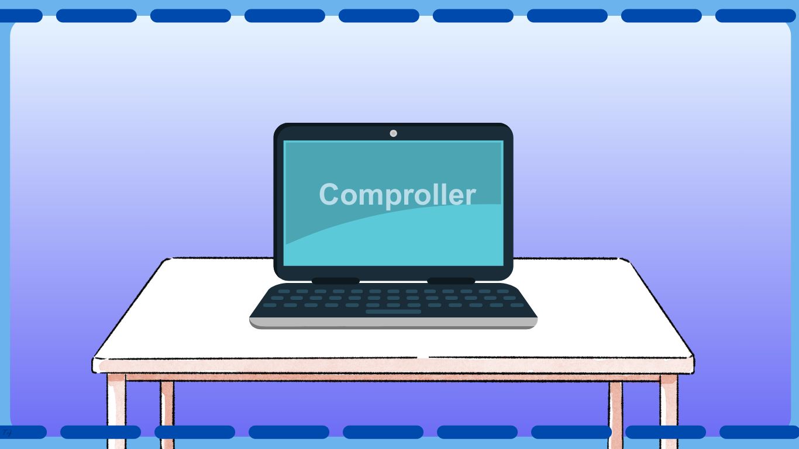

<b>Kiss Bercel</b> | <b>Papp Gyula</b> | <b>Németh Gábor</b>

---

## Programról:
A **Comproller**, másnéven *company controller*, egy olyan program, amely képes kezelni egy vállalat HR-, pénzügyi és egyéb menedzsmenttel kapcsolatos feladatait.

### Célja
A program célja, hogy egyszerű és átlátható virtuális környezetet nyújtson kis-, közép- és nagyvállalatok számára. Az alkalmazás segíti a vállalati folyamatok hatékony kezelését és nyomon követését.

---

### Használat és követelmények

Az alkalmazás használatához felhasználókat kell létrehozni.

A **Comproller** működéséhez az alábbiak szükségesek:

1. **Belső hálózat vagy webszerver**: Az alkalmazás futtatásához szükséges egy belső hálózati környezet vagy egy webszerver.
2. **Adatbázis**: A program helyes működéséhez és az adatok tárolásához és kezeléséhez az alkalmazáshoz konfigurált adatbázis szükséges.

---

Köszönjük, hogy használja a Comproller alkalmazást! A fejlesztésekkel kapcsolatos javaslatokat és hibajelentéseket örömmel fogadjuk.

---

<a href="https://drive.google.com/drive/folders/1L6zySRzp45_Y8vorld54O9FlnvdPsgSC">
<b>BEMUTATÓ</b>
</a>

---
